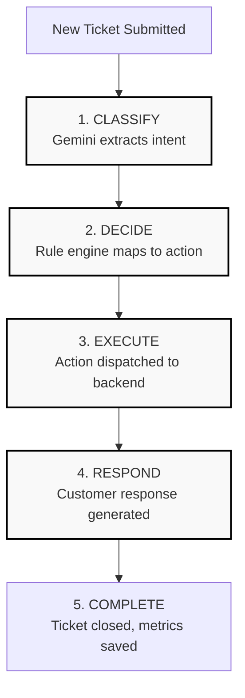

# SLAVE — Self-operating Logic & Autonomous Virtual Executor

> **"Give it the problem. It handles the workflow."**


**SLAVE** is an autonomous support-workflow execution system built to entirely replace manual ticket triaging and execution. 

Unlike generic ticket management dashboards where human agents manually click through stages, SLAVE takes over the entire lifecycle of a request. The moment a user submits a task, SLAVE autonomously classifies the intent, makes a deterministic decision, executes the action in the operational backend, and communicates the resolution back to the user.

---

## 📑 Table of Contents

- [Features](#-features)
- [The Autonomous Pipeline](#-the-autonomous-pipeline)
- [Architecture & Tech Stack](#-architecture--tech-stack)
- [Database Schema](#-database-schema)
- [Getting Started](#-getting-started)
- [Environment Variables](#-environment-variables)
- [Testing](#-testing)
- [Deployment](#-deployment)
- [API Reference](#-api-reference)

---

## ✨ Features

- **LLM-Powered Classification**: Uses Google Gemini to accurately extract intent, priority, and category from raw, unstructured user input.
- **Deterministic Rule Engine**: Translates LLM semantic understanding into strict, safe business logic to decide the next course of action.
- **Autonomous Execution**: Automatically executes actions such as creating engineering incidents, escalating to finance, generating knowledge-base articles, or resolving account issues.
- **Contextual Customer Response**: Dynamically generates a professional response to the customer based on the precise actions taken by the system.
- **Complete Audit Trail**: Records a granular, timestamped execution log of every step the system takes for full operational transparency.
- **Idempotency & Guardrails**: Built-in protections against duplicate executions, unsupported actions, and LLM hallucinations.
- **Neo-Brutalist UI**: A striking, high-contrast, edge-heavy operational console designed for maximum visibility and impact.

---

## 🚀 The Autonomous Pipeline

Every ticket submitted to SLAVE undergoes a strict, 5-stage automated pipeline.



1. **CLASSIFY (Understand)**: The Gemini LLM analyzes the raw customer request, extracting the core intent, category (e.g., technical, billing, account), priority (critical, high, low), and department.
2. **DECIDE**: A deterministic rule engine evaluates the classification against strict business rules to determine the safest action (e.g., `resolve`, `escalate`, `create_incident`, `create_kb`). It explicitly overrides LLM hallucinations.
3. **EXECUTE**: The execution engine dispatches the decided action. Secondary systems (incidents, escalations, knowledge bases) are updated autonomously.
4. **RESPOND**: A contextual, professional response is generated for the customer based on the executed actions.
5. **COMPLETE**: The ticket workflow is finalized, and a complete, timestamped audit log of every pipeline step is recorded.

---

## 🏗 Architecture & Tech Stack

SLAVE is built as a decoupled but cleanly integrated monolithic web service.

- **Frontend**: React 19 (via Vite), Tailwind CSS
- **Design System**: Custom Neo-Brutalist utility classes for a highly structural, terminal-like operational feel.
- **Backend**: Node.js, Express.js
- **Database**: SQLite3 (via `better-sqlite3`) — chosen for zero-config, ultra-fast local execution.
- **AI Integration**: `@google/genai` (Gemini 2.5 Flash API)

The backend handles static file serving of the frontend in production, making it a single deployable unit.

---

## 🗄 Database Schema

The SQLite database (`slave.db`) utilizes relational tables to track the complex operational outputs of the autonomous engine:

- `tickets`: The core requests submitted by users.
- `audit_log`: Append-only log tracking every micro-step of the pipeline.
- `automation_runs`: Performance metrics and execution tracking for each pipeline run.
- `incidents`: Engineering tasks created when the engine triggers `create_incident`.
- `escalations`: High-priority tasks routed to human departments when triggered by `escalate`.
- `knowledge_articles`: Documentation drafts created automatically via `create_kb`.

---

## 📦 Getting Started

### Prerequisites
- **Node.js** (v20.x or higher)
- **Gemini API Key** (Get one from Google AI Studio)

### Installation
1. **Clone the repository:**
   ```bash
   git clone https://github.com/yourusername/slave.git
   cd slave
   ```

2. **Run the setup script:**
   This will install all NPM dependencies for both the `server` and `client`, and initialize your environment files.
   ```bash
   npm run setup
   ```

3. **Configure Environment:**
   Open `server/.env` and add your Gemini API Key:
   ```env
   GEMINI_API_KEY="your_api_key_here"
   ```

### Development
Start the application in development mode (spins up both the Vite dev server and Express API):
```bash
npm run dev
```
- Frontend: `http://localhost:5173`
- Backend API: `http://localhost:3001`

---

## ⚙️ Environment Variables

The `server/.env` file accepts the following configurations:

| Variable | Description | Default |
|----------|-------------|---------|
| `PORT` | The port the Express server listens on. | `3001` |
| `GEMINI_API_KEY` | Your Google Gemini API Key. | *None* |
| `DATABASE_PATH` | Absolute path to the SQLite database. | `server/slave.db` |
| `AI_FALLBACK` | If `true`, bypasses Gemini and uses deterministic mock data. | `false` |

*(Note: The frontend does not require any `.env` files. It dynamically routes to `/api` in production).*

---

## 🧪 Testing

SLAVE includes a comprehensive, 120+ assertion test suite that can run completely isolated from your production database and without a Gemini API Key.

```bash
npm test
```

### How the tests work:
The test suite utilizes a deterministic `AI_FALLBACK=true` mode and an ephemeral `test.db` to verify the rule engine, execution pipeline, and API endpoints reliably. 
**No manual database seeding or server startup is required to run the tests.**

For a detailed breakdown of test coverage, please see [TESTING.md](./TESTING.md).

---

## ☁️ Deployment

The project is configured for a frictionless single-service deployment on platforms like Render, Heroku, or Railway. The Express backend serves the Vite production build and handles SPA fallback routing natively.

### Render Deployment
To deploy on Render as a Web Service:

- **Build Command**: `npm run build`
- **Start Command**: `npm start`
- **Environment Variables**: 
  - `NODE_ENV=production`
  - `GEMINI_API_KEY=your_key`
  - `DATABASE_PATH=/var/data/slave.db` *(Optional: If using a persistent disk mount)*

You can also use the included `render.yaml` blueprint.

---

## 🔌 API Reference

The backend exposes a RESTful API utilized by the Operations Console:

- `GET /api/health` - System status and database connectivity.
- `GET /api/tickets/metrics/summary` - Aggregated operational metrics.
- `GET /api/tickets?limit=50` - List active and historical tickets.
- `GET /api/tickets/:id` - Detailed view of a ticket, its execution outputs, and its audit trail.
- `POST /api/tickets` - Ingest a new request.
- `POST /api/tickets/:id/automate` - Trigger the complete autonomous pipeline end-to-end.
